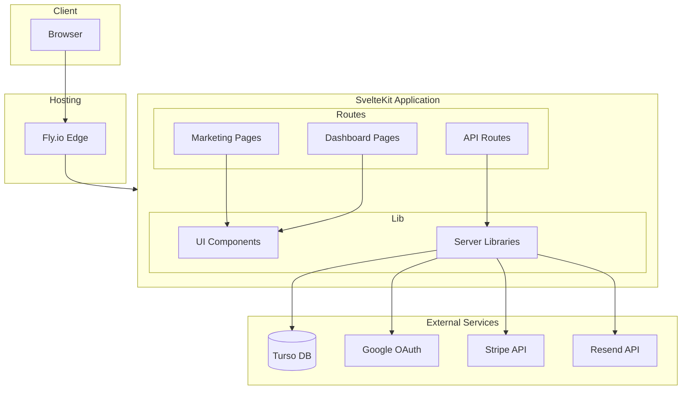
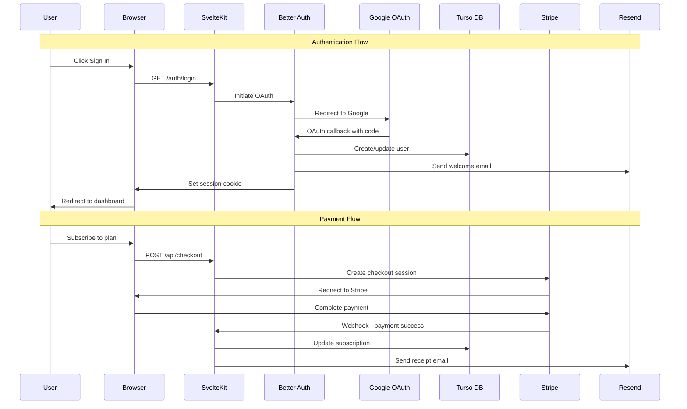
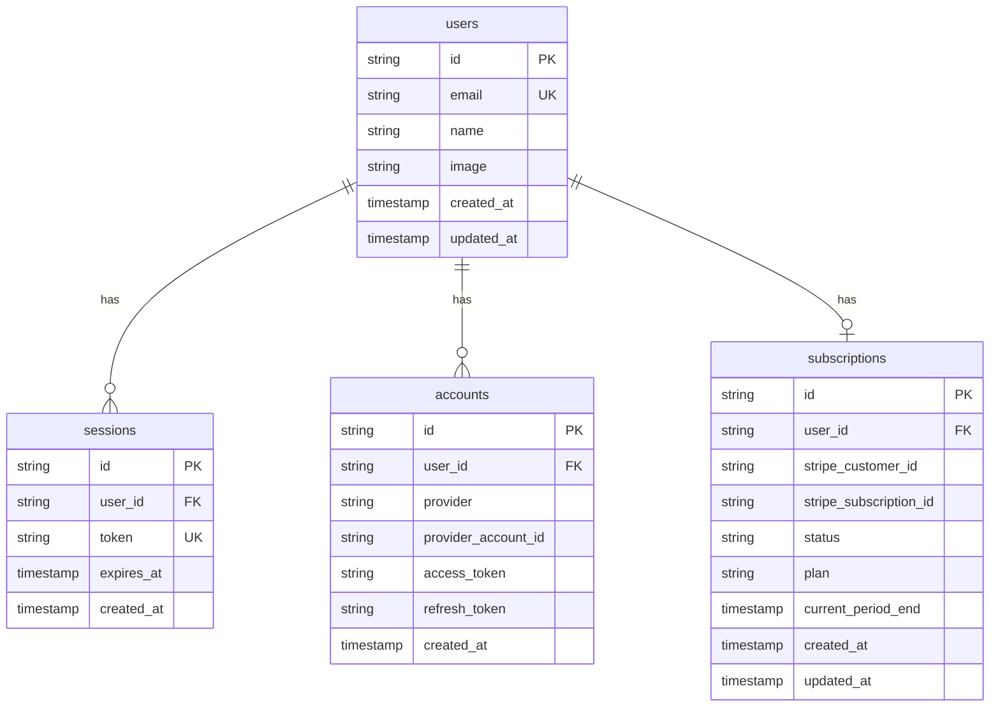

# JabStack Architecture Plan

## Overview

JabStack is a modern, full-stack starter template designed for personal projects that require both marketing pages and user dashboards. It prioritizes developer experience, type safety, and deployment simplicity.

## Technology Stack

| Category | Technology | Purpose |
|----------|------------|---------|
| Runtime | Bun | Fast JavaScript runtime, package manager, and bundler |
| Language | TypeScript | Type-safe JavaScript |
| Framework | SvelteKit | Full-stack web framework with SSR/SSG/SPA support |
| Database | Turso / SQLite | LibSQL for production, SQLite for local development |
| ORM | Drizzle | Type-safe SQL ORM with excellent DX |
| Auth | Better Auth | Modern auth library with OAuth support |
| Payments | Stripe | Payment processing |
| Email | Resend | Transactional email service |
| Dashboard UI | shadcn-svelte + Tailwind CSS | Pre-styled components for dashboard interfaces |
| Marketing UI | Bits UI + Tailwind CSS | Headless primitives for fully custom marketing designs |
| Hosting | Fly.io | Edge deployment platform |
| Testing | Vitest | Unit testing framework |

## Project Structure

```
jabstack/
├── src/
│   ├── lib/
│   │   ├── components/
│   │   │   ├── ui/                    # shadcn-svelte components
│   │   │   ├── dashboard/             # Dashboard-specific components
│   │   │   │   ├── sidebar.svelte
│   │   │   │   ├── stats-card.svelte
│   │   │   │   ├── area-chart.svelte
│   │   │   │   └── data-table.svelte
│   │   │   └── marketing/             # Marketing page components
│   │   ├── server/
│   │   │   ├── db/
│   │   │   │   ├── index.ts           # Database client
│   │   │   │   ├── schema.ts          # Drizzle schema
│   │   │   │   └── migrations/        # Database migrations
│   │   │   ├── auth.ts                # Better Auth configuration
│   │   │   ├── stripe.ts              # Stripe configuration
│   │   │   └── email.ts               # Resend configuration
│   │   ├── env.ts                     # Environment variable validation
│   │   ├── utils.ts                   # Utility functions
│   │   └── types.ts                   # Shared TypeScript types
│   ├── routes/
│   │   ├── +layout.svelte             # Root layout
│   │   ├── +layout.server.ts          # Root server layout - auth session
│   │   ├── +page.svelte               # Marketing home page
│   │   ├── auth/
│   │   │   ├── login/+page.svelte     # Login page
│   │   │   ├── register/+page.svelte  # Registration page
│   │   │   └── callback/+server.ts    # OAuth callback handler
│   │   ├── dashboard/
│   │   │   ├── +layout.svelte         # Dashboard layout with sidebar
│   │   │   ├── +layout.server.ts      # Auth guard
│   │   │   ├── +page.svelte           # Main dashboard - dashboard-01
│   │   │   └── settings/+page.svelte  # User settings
│   │   ├── api/
│   │   │   ├── auth/[...all]/+server.ts  # Better Auth API routes
│   │   │   └── webhooks/
│   │   │       └── stripe/+server.ts     # Stripe webhook handler
│   │   └── [...catchall]/+page.svelte    # 404 page
│   ├── app.html                       # HTML template
│   ├── app.css                        # Global styles + Tailwind
│   └── app.d.ts                       # TypeScript declarations
├── static/
│   ├── favicon.ico
│   └── robots.txt
├── tests/
│   └── unit/                          # Vitest unit tests
├── .env.example                       # Environment variable template
├── .gitignore
├── Dockerfile                         # Bun-based Docker image for Fly.io
├── fly.toml                           # Fly.io configuration
├── drizzle.config.ts                  # Drizzle ORM configuration
├── svelte.config.js                   # SvelteKit configuration
├── tailwind.config.ts                 # Tailwind CSS configuration
├── tsconfig.json                      # TypeScript configuration
├── vite.config.ts                     # Vite configuration
├── vitest.config.ts                   # Vitest configuration
├── package.json
├── bun.lockb                          # Bun lock file
├── README.md
├── CLAUDE.md                          # AI context for Claude/Cursor/Windsurf
├── .cursorrules                       # Cursor IDE rules
└── .windsurfrules                     # Windsurf IDE rules
```

## Architecture Diagram



## Data Flow Diagram



## Database Schema



## Environment Variables

```bash
# Database
DATABASE_URL=               # Turso database URL - libsql://...
DATABASE_AUTH_TOKEN=        # Turso auth token

# Auth
BETTER_AUTH_SECRET=         # Random secret for session encryption
GOOGLE_CLIENT_ID=           # Google OAuth client ID
GOOGLE_CLIENT_SECRET=       # Google OAuth client secret

# Stripe
STRIPE_SECRET_KEY=          # Stripe secret key
STRIPE_WEBHOOK_SECRET=      # Stripe webhook signing secret
PUBLIC_STRIPE_PUBLISHABLE_KEY=  # Stripe publishable key - client-safe

# Email
RESEND_API_KEY=             # Resend API key

# App
PUBLIC_APP_URL=             # Application URL - https://your-app.fly.dev
```

## Key Implementation Details

### 1. SvelteKit Adapter for Bun

Using `svelte-adapter-bun` for optimal Bun compatibility:

```javascript
// svelte.config.js
import adapter from 'svelte-adapter-bun';

export default {
  kit: {
    adapter: adapter()
  }
};
```

### 2. Environment Validation

Type-safe environment variables with Zod:

```typescript
// src/lib/env.ts
import { z } from 'zod';
import {
  DATABASE_URL,
  DATABASE_AUTH_TOKEN,
  // ... other imports
} from '$env/static/private';
import {
  PUBLIC_STRIPE_PUBLISHABLE_KEY,
  PUBLIC_APP_URL
} from '$env/static/public';

const envSchema = z.object({
  DATABASE_URL: z.string().url(),
  DATABASE_AUTH_TOKEN: z.string().min(1),
  // ... validation rules
});

export const env = envSchema.parse({
  DATABASE_URL,
  DATABASE_AUTH_TOKEN,
  // ... values
});
```

### 3. Database Setup with Drizzle

Local SQLite for development, Turso for production:

```typescript
// src/lib/server/db/index.ts
import { drizzle } from 'drizzle-orm/libsql';
import { createClient } from '@libsql/client';
import { env } from '$lib/env';

const client = createClient({
  url: env.DATABASE_URL,
  authToken: env.DATABASE_AUTH_TOKEN
});

export const db = drizzle(client);
```

### 4. Better Auth Configuration

```typescript
// src/lib/server/auth.ts
import { betterAuth } from 'better-auth';
import { drizzleAdapter } from 'better-auth/adapters/drizzle';
import { db } from './db';

export const auth = betterAuth({
  database: drizzleAdapter(db),
  socialProviders: {
    google: {
      clientId: env.GOOGLE_CLIENT_ID,
      clientSecret: env.GOOGLE_CLIENT_SECRET
    }
  }
});
```

### 5. Dockerfile for Fly.io

```dockerfile
FROM oven/bun:1 AS builder
WORKDIR /app
COPY package.json bun.lockb ./
RUN bun install --frozen-lockfile
COPY . .
RUN bun run build

FROM oven/bun:1-slim
WORKDIR /app
COPY --from=builder /app/build ./build
COPY --from=builder /app/package.json ./
ENV NODE_ENV=production
EXPOSE 3000
CMD ["bun", "./build"]
```

## MCP Server Configurations

### Stripe MCP

```json
{
  "mcpServers": {
    "stripe": {
      "command": "npx",
      "args": ["-y", "@stripe/mcp", "--tools=all", "--api-key=STRIPE_SECRET_KEY"]
    }
  }
}
```

### Turso MCP

```json
{
  "mcpServers": {
    "turso": {
      "command": "npx",
      "args": ["-y", "@turso/mcp"]
    }
  }
}
```

## UI Library Strategy

JabStack uses two complementary UI libraries for different purposes:

### Dashboard Pages - shadcn-svelte

- **Location**: `/src/lib/components/ui/` and `/src/routes/dashboard/`
- **Why**: Pre-styled, consistent components that work out of the box
- **Components**: Buttons, cards, tables, charts, sidebar, forms, dialogs
- **Benefit**: Rapid dashboard development with professional appearance

### Marketing Pages - Bits UI

- **Location**: `/src/lib/components/marketing/` and `/src/routes/` (non-dashboard)
- **Why**: Headless primitives that provide accessibility and behavior without styling
- **Components**: Accordions, dialogs, menus, tabs, tooltips - all unstyled
- **Benefit**: Complete design freedom for unique marketing page aesthetics

This separation allows:

- Consistent, polished dashboard UX across all projects
- Unique, branded marketing pages per project
- Both libraries share Tailwind CSS for styling

## Dashboard Components - dashboard-01

The dashboard implements the shadcn dashboard-01 block with:

1. **Collapsible Sidebar** - Navigation with icons, collapsible to icon-only mode
2. **Stats Cards** - Four metric cards showing key statistics
3. **Area Chart** - Time-series visualization with period filters
4. **Data Table** - Tabbed data table with sorting and filtering

All components use static placeholder data for flexibility across different project types.

## Deployment Checklist

1. Create Turso database and get credentials
2. Set up Google OAuth credentials
3. Create Stripe account and get API keys
4. Create Resend account and get API key
5. Create Fly.io app: `fly apps create jabstack`
6. Set secrets: `fly secrets set DATABASE_URL=... DATABASE_AUTH_TOKEN=...`
7. Deploy: `fly deploy`

## Next Steps After Setup

When starting a new project from JabStack:

1. Clone the repository
2. Update `package.json` with new project name
3. Create new Turso database for the project
4. Update environment variables
5. Customize dashboard sidebar navigation
6. Modify database schema for project needs
7. Update marketing home page content
8. Deploy to Fly.io with new app name
